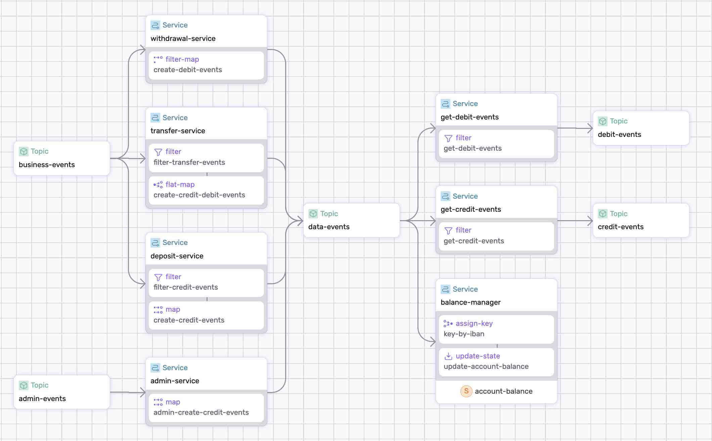

# Bank Processing Data Pipeline

The bank processing data pipeline ingests business events such as deposits, withdrawals, or transfers, transforms them into debit and credit events, computes the balance for each account. 

**Note:** In the next version, the data pipeline will also detect insufficient funds and perform anomaly detection.


<p align="center">
 
</p>

## Pipeline Primitives

The pipeline uses the following primitives:
* _window_
  * _assign-timestamp_
  * _assign-key_
  * _update-state_
  * _flush_ 
    * _aggregate_
* _flat-map_
* _states_


## Step-by-step

Take a look at the [data-pipeline.yaml](./data-pipeline.yaml) to get an idea of what we're doing.

Make sure to [Install SSDK and start a Fluvio cluster].

### 1. Generate and Build

Generate and Build the data pipeline;

```bash
ssdk generate
ssdk build
```

### 2. Run the Pipeline

Run the pipeline:

```bash
 ssdk run --ui
```

Use `--ui` to open the Studio.


### 3. Test the Pipeline

#### 3.1 Add Account

Produce an `add-account` events to `admin-events` topic :

Add `duncan`:
```
fluvio produce admin-events --raw --file ./sample-data/add-account-duncan.json
```

Add `lucy`:
```
fluvio produce admin-events --raw --file ./sample-data/add-account-lucy.json
```

Check state in `ssdk` terminal:

```
>> show state balance-manager/account-balance/state --table
 Key                     balance  name           
 GB36MWIE43141216656969  2500     Lucy Cechtelar 
 GB56DVTE70858022060682  1000     Duncan Taylor
```

#### 3.2 Withdrawal

Produce an `deposit` events to `business-events` topic :

Deposit `duncan`:

```
fluvio produce business-events --raw --file ./sample-data/deposit-duncan.json 
```

Deposit `lucy`:

```
fluvio produce business-events --raw --file ./sample-data/deposit-lucy.json  
```

Check state in `ssdk` terminal:

```
>> show state balance-manager/account-balance/state --table
 Key                     balance  name           
 GB36MWIE43141216656969  2700     Lucy Cechtelar 
 GB56DVTE70858022060682  1500     Duncan Taylor  
```

#### 3.3 Withdrawal

Produce an `withdrawal` events to `business-events` topic :

Withdrawal `duncan`:

```
fluvio produce business-events --raw --file ./sample-data/withdrawal-duncan.json 
```

Withdrawal `lucy`:

```
fluvio produce business-events --raw --file ./sample-data/withdrawal-lucy.json  
```

Check state in `ssdk` terminal:

```
>> show state balance-manager/account-balance/state --table
 Key                     balance  name           
 GB36MWIE43141216656969  2660     Lucy Cechtelar 
 GB56DVTE70858022060682  1420     Duncan Taylor
```

#### 3.4 Transfer

Produce an `transfer` events to `business-events` topic :

Transfer from `duncan` to `lucy`:

```
fluvio produce business-events --raw --file ./sample-data/transfer-duncan-to-lucy.json 
```

Check state in `ssdk` terminal:

```
>> show state balance-manager/account-balance/state --table
 Key                     balance  name           
 GB36MWIE43141216656969  2710     Lucy Cechtelar 
 GB56DVTE70858022060682  1370     Duncan Taylor 
```

Transfer from `lucy` to `duncan`:

```
fluvio produce business-events --raw --file ./sample-data/transfer-lucy-to-duncan.json 
```

Check state in `ssdk` terminal:

```
>> show state balance-manager/account-balance/state --table
 Key                     balance  name           
 GB36MWIE43141216656969  2610     Lucy Cechtelar 
 GB56DVTE70858022060682  1470     Duncan Taylor  
```


[Install SSDK & Start a Cluster]: /README.MD#prerequisites
