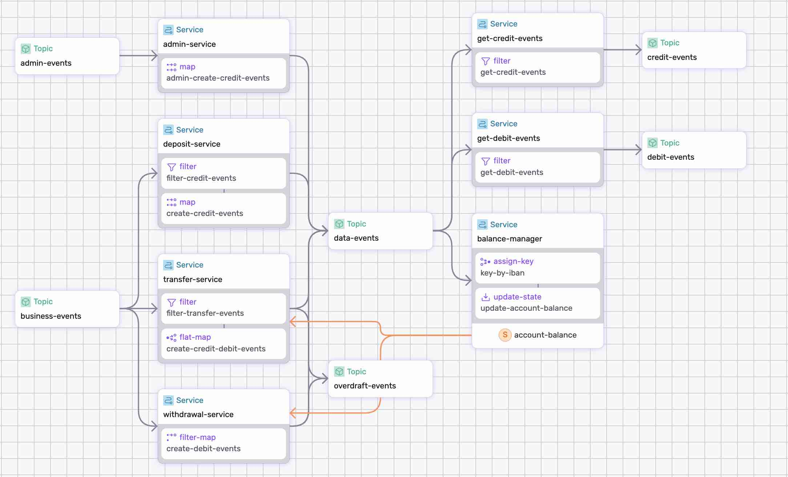

# Bank Processing Data Pipeline

The bank processing data pipeline ingests business events such as deposits, withdrawals, or transfers, transforms them into debit and credit events, computes the balance for each account.  

In addition, the data pipeline detects insufficient funds and sends an events to an `overdraft` topic.


<p align="center">
 
</p>

## Pipeline Primitives

The pipeline uses the following primitives:

* _map_
* _filter_
* _filter-map_
* _flat-map_
* _assign-key_
* _update-state_
* _states_ (ref-state)

It also shows the ability to split traffic, by sending records to different topics.


## Step-by-step

Take a look at the [data-pipeline.yaml](./data-pipeline.yaml) to get an idea of what we're doing.

Make sure to [Install SSDK and start a Fluvio cluster].

### 1. Generate and Build

Generate and Build the data pipeline;

```bash
ssdk generate
ssdk build
```

### 2. Run the Pipeline

Run the pipeline:

```bash
 ssdk run --ui
```

Use `--ui` to open the Studio.


### 3. Test the Pipeline

Use `fluvio consume` command to read from multiple streams in parallel:

* `admin-events`
* `business-events`
* `data-events`
* `debit-events`
* `credit-events`
* `overdraft-events`


#### 3.1 Add Account

Produce an `add-account` events to `admin-events` topic :

Add `duncan`:
```
fluvio produce admin-events --raw --file ./sample-data/add-account-duncan.json
```

Add `lucy`:
```
fluvio produce admin-events --raw --file ./sample-data/add-account-lucy.json
```

Check state in `ssdk` terminal:

```
>> show state balance-manager/account-balance/state --table
 Key                     balance  name           
 GB36MWIE43141216656969  2500     Lucy Cechtelar 
 GB56DVTE70858022060682  1000     Duncan Taylor
```

Check the events in the following topics: `admin-events`, `data-events`, `credit-events`.

#### 3.2 Deposit

Produce an `deposit` events to `business-events` topic :

Deposit `duncan`:

```
fluvio produce business-events --raw --file ./sample-data/deposit-duncan.json 
```

Deposit `lucy`:

```
fluvio produce business-events --raw --file ./sample-data/deposit-lucy.json  
```

Check state in `ssdk` terminal:

```
>> show state balance-manager/account-balance/state --table
 Key                     balance  name           
 GB36MWIE43141216656969  2700     Lucy Cechtelar 
 GB56DVTE70858022060682  1500     Duncan Taylor  
```

Check the events in the following topics: `business-events`, `data-events`, `credit-events`.


#### 3.3 Withdrawal

Produce an `withdrawal` events to `business-events` topic :

Withdrawal `duncan`:

```
fluvio produce business-events --raw --file ./sample-data/withdrawal-duncan.json 
```

Withdrawal `lucy`:

```
fluvio produce business-events --raw --file ./sample-data/withdrawal-lucy.json  
```

Check state in `ssdk` terminal:

```
>> show state balance-manager/account-balance/state --table
 Key                     balance  name           
 GB36MWIE43141216656969  2660     Lucy Cechtelar 
 GB56DVTE70858022060682  720      Duncan Taylor  
```

Check the events in the following topics: `business-events`, `data-events`, `debit-events`.

#### 3.4 Transfer

Produce an `transfer` events to `business-events` topic :

Transfer from `duncan` to `lucy`:

```
fluvio produce business-events --raw --file ./sample-data/transfer-duncan-to-lucy.json 
```

Check state in `ssdk` terminal:

```
>> show state balance-manager/account-balance/state --table
 Key                     balance  name           
 GB36MWIE43141216656969  2710     Lucy Cechtelar 
 GB56DVTE70858022060682  670      Duncan Taylor 
```

Transfer from `lucy` to `duncan`:

```
fluvio produce business-events --raw --file ./sample-data/transfer-lucy-to-duncan.json 
```

Check state in `ssdk` terminal:

```
>> show state balance-manager/account-balance/state --table
 Key                     balance  name           
 GB36MWIE43141216656969  2610     Lucy Cechtelar 
 GB56DVTE70858022060682  770      Duncan Taylor  
```

Check the events in the following topics: `business-events`, `data-events`, `credit-events`, `debit-events`.

#### 3.4 Overdraft

To trigger an overdraft, withdraw additinal funds from Duncan:

Withdrawal `duncan`:

```
fluvio produce business-events --raw --file ./sample-data/withdrawal-duncan.json 
```

Check the events in the following topics: `business-events`, `data-events`, `debit-events`, `overdraft-events`.

```
>> show state balance-manager/account-balance/state --table
 Key                     balance  name           
 GB36MWIE43141216656969  2610     Lucy Cechtelar 
 GB56DVTE70858022060682  -10      Duncan Taylor  
```

[Install SSDK & Start a Cluster]: /README.MD#prerequisites
