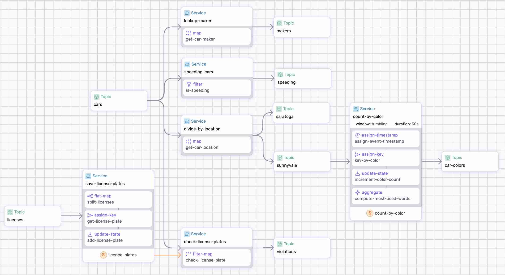

# Car Counter Data Pipeline

The car processing data pipeline reads car events from the `cars` and `licenses` topics and performs a series of operations:

* Identify speeding vehicles (filter-map).
* Divide the events based on location (split).
* Count the cars based on color (tumbling windows).
* Identify stolen license plates (ref state).

The following diagram is a visual representation of these operations generated by `ssdk`:

<p align="center">
 
</p>

## Event Generation

There are two event types generated by a couple of HTTP-source connectors streaming synthetic data from `data.infinyon.com`.


#### Car Events Connector

The first connector reads `car events` at a rate of 2 events per second. The events model two semaphores, Saratoga and Sunnyvale, and produce the following information:

```json
{
  "maker": "Fiat",
  "model": "124 Spider",
  "category": "Convertible",
  "color": "beige",
  "license": "7WPK493",
  "fuel": "gasoline",
  "location": "Saratoga",
  "mph": 43,
  "timestamp": "2024-03-14T16:12:10.493Z"
}
```

This connector sends events to `cars` topic.

#### License Plates Connector

The second connector reads car licenses every hour to emulate a database read of license places from an official organization such as the Department of Motor Vehicles (DMV).


```json
[
  {
    "maker": "Toyota",
    "model": "Camry",
    "license": "0VTI452"
  },
  {
    "maker": "Ford",
    "model": "Fusion",
    "license": "7YHM485"
  },
  ...
]
```

The connector sends events to `licenses` topic.

## Step-by-step

Take a look at the [data-pipeline.yaml](./data-pipeline.yaml) to get an idea of what we're doing.

Make sure to [Install SSDK and start a Fluvio cluster].

### 1. Generate and Build

Generate and Build the data pipeline;

```bash
ssdk generate
ssdk build
```

### 2. Run the Pipeline

Run the pipeline:

```bash
 ssdk run --ui
```

Use `--ui` to generate the graphical representation and run the Studio.


#### 3. Start the connectors:


In the `./connectors` directory, download the connector binary, and start theconnectors that feed the licenses and the car events:

```bash
cdk hub download infinyon/http-source@0.3.3
```

```bash
cdk deploy start --ipkg infinyon-http-source-0.3.3.ipkg -c license-connector.yaml
```

```bash
cdk deploy start --ipkg infinyon-http-source-0.3.3.ipkg -c car-connector.yaml
```

To see the events, run `fluvio consume cars`.  For additional context, checkout [connectors](./connectors/).


#### 3. Check the results

Let's check the ssdk internal state and external events.

#### Internal State

Use show state command to see the internal objects maintained by the pipeline:

```bash
>> show state
 Namespace                                  Keys  Type      
 lookup-maker/cars/topic.offset             1     offset    
 save-license-plates/licence-plates/state   100   u32       
 save-license-plates/licenses/topic.offset  1     offset    
 speeding-cars/cars/topic.offset            1     offset    
 check-license-plates/cars/topic.offset     1     offset    
 count-by-color/sunnyvale/topic.offset      1     offset    
 divide-by-location/cars/topic.offset       1     offset    
 count-by-color/count-by-color/watermark    1     timestamp 
 count-by-color/count-by-color/state        5     u32  
 ```

Aside from the offsets that saves the progress of consuming from topics, the pipeline maintains the following internal states:
* license plates
* count by color
* watermark

**License Plates** state stores the license plates read from the `licenses` topic. This is used to check for stolen plates later in the pipeline.

```bash
>> show state save-license-plates/licence-plates/state --table
 Key      maker          model          
 0FDR715  Buick          Encore         
 0FJV738  Ford           Explorer       
 0FQP572  Tesla          Model S        
 0GFX265  Volvo          V90            
 ...
```

**Count by Clates** collects the number of cars for each color. This window is flushed to the `car-colors` topic every 30 seconds.

```bash
>> show state count-by-color/count-by-color/state 
 Key     Value  Window                                    
 beige   2      2024-03-15T13:39:30Z:2024-03-15T13:40:00Z 
 blue    1      2024-03-15T13:39:30Z:2024-03-15T13:40:00Z 
 green   1      2024-03-15T13:39:30Z:2024-03-15T13:40:00Z 
 orange  1      2024-03-15T13:39:30Z:2024-03-15T13:40:00Z 
 perl    2      2024-03-15T13:39:30Z:2024-03-15T13:40:00Z 
 white   1      2024-03-15T13:39:30Z:2024-03-15T13:40:00Z 
 yellow  1      2024-03-15T13:39:30Z:2024-03-15T13:40:00Z 
```

**Watermark** tracks the cutoff timestamp for tumbling windows.

```bash
>> show state count-by-color/count-by-color/watermark
 Key      Value                     Window 
 default  2024-03-15T13:44:30.043Z  *   
```

This is used to determine when to flush window state for the tumbling window that counts the cars by color, flushing state to the 'car-colors' topic.


#### Car Makers 

Each car event triggers an `http call-out` to gather additional information about the car maker:

```bash
$ fluvio consume makers
{"continent":"Europe","country":"Germany","maker":"Audi"}
{"continent":"Europe","country":"United Kingdom","maker":"McLaren"}
{"continent":"Europe","country":"Italy","maker":"Fiat"}
...
```

Hit <Ctrl-C> to exit.


#### Speeding Cars

All cars driving faster than `45 mph` are speeding:

```bash
$ fluvio consume speeding
Consuming records from 'speeding'
{"color":"beige","license":"9HPJ645","location":"Saratoga","maker":"Maserati","model":"Levante","mph":46,"timestamp":"2024-03-15T13:50:27.425Z"}
{"color":"grey","license":"0ZBM819","location":"Saratoga","maker":"Lexus","model":"RX","mph":62,"timestamp":"2024-03-15T13:50:28.925Z"}
{"color":"grey","license":"0LZK936","location":"Saratoga","maker":"Audi","model":"A6","mph":57,"timestamp":"2024-03-15T13:50:29.426Z"}
...
```

Hit <Ctrl-C> to exit.


#### Split Traffic

Split the traffic into two streams based on the `location` field:

```bash
$  fluvio consume sunnyvale
Consuming records from 'sunnyvale'
{"car":"Tesla Model Y","color":"yellow","location":"Sunnyvale"}
{"car":"Smart Fortwo","color":"yellow","location":"Sunnyvale"}
{"car":"Honda Accord","color":"orange","location":"Sunnyvale"}
...
```

```bash
$  fluvio consume saratoga 
Consuming records from 'saratoga'
{"car":"Subaru BRZ","color":"green","location":"Saratoga"}
{"car":"Mazda Mazda3","color":"beige","location":"Saratoga"}
{"car":"Chevrolet Blazer","color":"beige","location":"Saratoga"}
...
```

Hit <Ctrl-C> to exit.


#### Count Cars

Count all cars seen at the Sunnyvale location by colors. As mentioned above, the cars are counted and flushed to the 'car-colors' topic every 30 seconds.

```bash
fluvio consume car-colors
Consuming records from 'car-colors'
[{"color":"beige","count":1},{"color":"perl","count":4},{"color":"orange","count":6},{"color":"blue","count":3},{"color":"green","count":1},{"color":"grey","count":3},{"color":"red","count":3},{"color":"black","count":4},{"color":"yellow","count":3}]
[{"color":"perl","count":1},{"color":"beige","count":6},{"color":"yellow","count":2},{"color":"green","count":1},{"color":"black","count":2},{"color":"orange","count":3},{"color":"red","count":2},{"color":"white","count":3},{"color":"grey","count":1},{"color":"blue","count":5}]
...
```

You may use `--output json` for pretty formatting. Hit <Ctrl-C> to exit.


#### Annomaly Detection

The pipeline also detects anomalies by check if a license plate is seen in 2 different cars. To demonstrate this functionality, we are ingesting a data set that send an annomaly every 10 records (~5 sec).

```bash
$ fluvio consume violations -O json
Consuming records from 'violations'
{
  "license": "1KFR357",
  "owner": "Maserati Quattroporte",
  "violator": "Chevrolet Equinox"
}
{
  "license": "0FQP572",
  "owner": "Land Rover Discovery",
  "violator": "Tesla Model S"
}
{
  "license": "2RFQ375",
  "owner": "Audi Q7",
  "violator": "Infiniti Q50"
}
```

For simplicity, the code assumes that the first car is always the owner, and the 2nd is the violator. 

### Clean-up

Note that your connectors will continue running in the background until you shut them down:

```bash
cdk deploy shutdown --name car-connector
cdk deploy shutdown --name license-connector
```

Finally, type `exit` in the ssdk terminal to close the process.


[Install SSDK & Start a Cluster]: /README.MD#prerequisites
