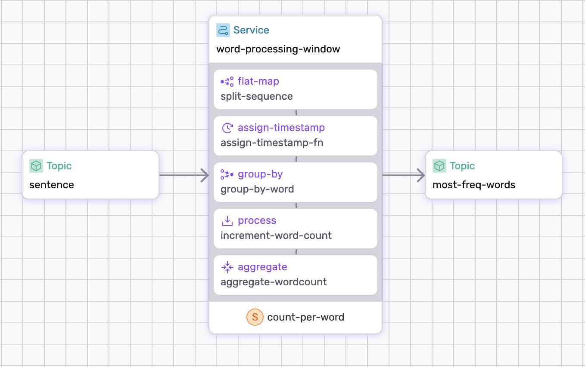

# Word Count Window Processing

In this example, we'll develop a data pipeline for window processing that analyzes sentences and computes the three most frequently used words in 20-second intervals.

<p align="center">
 
</p>

## Prerequisites

* Follow the instructions on the front-page to [Install SSDK & Start a Cluster].


## Step-by-step

Take a look at the [data-pipeline.yaml](./data-pipeline.yaml) to get an idea of what we're doing.


### 1. Generate and Build

Generate and Build the data pipeline;

```bash
ssdk generate
ssdk build
```

### 2. Run the Pipeline

Run the pipeline:

```bash
 ssdk run --ui
```

Use `--ui` to open the Studio.


### 3. Test the Pipeline

#### 1. Produce to Source Topic

Produce sentences to in `sentence` topic:

```bash
echo "behind every great man is a woman rolling her eyes" | fluvio produce sentence
```

```bash
echo "the eyes reflect what is in the heart and soul" | fluvio produce sentence
```

```bash
echo "keep your eyes on the stars and your feet on the ground" | fluvio produce sentence
```

```bash
echo "obstacles are those frightful things you see when you take your eyes off your goal" | fluvio produce sentence
```

**Note:**

> The watermark closes the window on event. Hence, if you stop adding events before the watermark triggers, the window stays open, and nothing gets produced. This is the expected behavior as, in most cases, external entities will continuously produce data, and you won’t be left with an open window. To force the window to flush, produce one more record after the 20-second mark.

In subsequent releases, we’ll add an idle watermark trigger to cover manual testing.

#### 2. Consume from Sink Topic

Consume from `most-used-words` topic:

```bash
fluvio consume most-used-words -B -O json
```

Depending when the 20 second window triggered, you'll see the top 3 words:

```bash
[
  {
    "count": 2,
    "word": "is"
  },
  {
    "count": 2,
    "word": "the"
  },
  {
    "count": 2,
    "word": "eyes"
  }
]
```

#### 3. Check the state

SSDK window allows you to watch the internal states:

```bash
show state
```

You may also look at windows that have not yet been flushed:

```bash
show state word-processing-window/count-per-word/state
```

**Note:** The data pipeline stops processing records when you close the intractive editor. To resume processing, run `ssdk run` again.


#### 4. Produce Continuous Data (optional)

You may also start an http-source connector that continuously feed data to the `sentence` topic. For instructions, checkout [connector.md](connector.md).


[Install SSDK & Start a Cluster]: /README.MD#prerequisites
